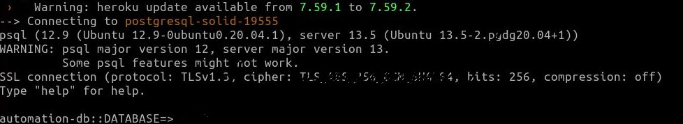
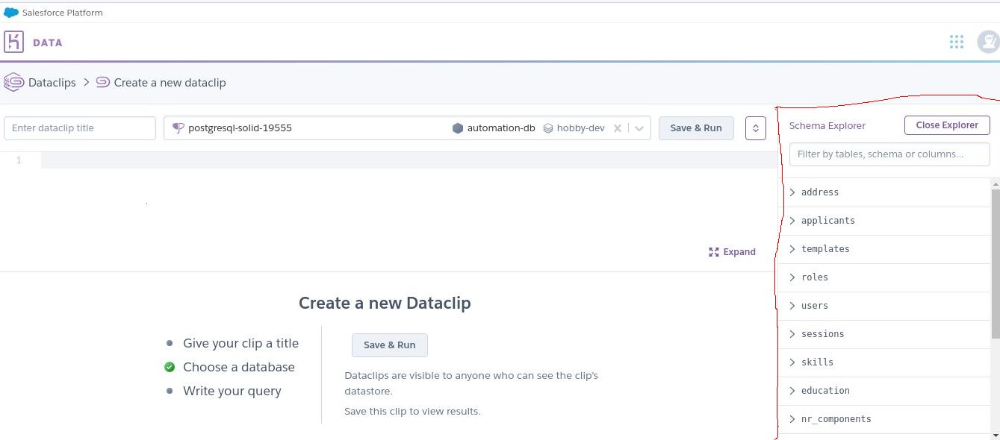
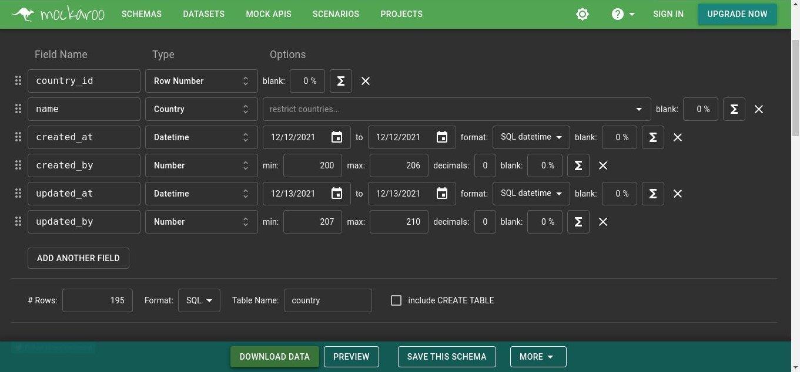
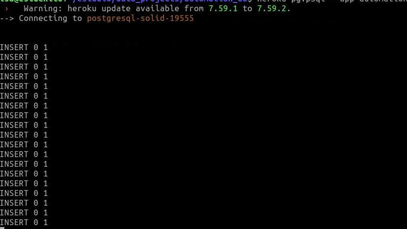
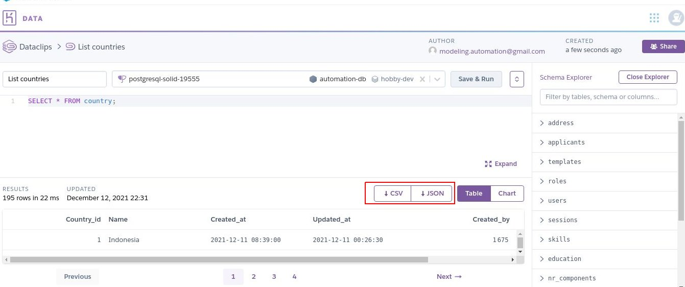

# Deployment of a PostgreSQL Database in Heroku 

This is an exercise to try Postgres and Heroku.

## 1 Set a Postgres Database
1. Create a new Heroku app.
2. Add a PostreSQL database:
	*  Navigate to the Resources tab in the header of your newly created app's dahsboard. 
	*  Then type Heroku Postgres into the Add-ons search field.When shown, select the suggested Heroku Postgres add-on from the dropdown.
	*  The next popup asks you to choose a pricing plan for the database. Select the Hobby Dev - Free plan and click Provision.
3. Access the database credentials (and connection URL)
	* Navigate to the Resources tab in your app's dashboard again and select the Heroku Postgres resource.
	* Now select the Settings tab in the header of that screen.
	* Here, you can click the View Credentials button to see the credentials of your PostgreSQL database.

## 2 Configure Heroku CLI

The Heroku Command Line Interface (CLI) makes it easy to create and manage your Heroku apps directly from the terminal. 
It’s an essential part of using Heroku.

* In case you dont have installed foolow the instructons from Heroku site](https://devcenter.heroku.com/articles/heroku-cli)
* Login in your terminal.
* To test the conection you should introduce credentials:
	```
	heroku pg:psql postgresql-solid-19555 --app name_app
	```
	

## 3. Write a Postgres script to create the database tables.

According to ER diagmam write the sentences to create the database tables. ➡️ [automation_ER.sql](automation_ER.sql)


## 4. Create the database from terminal

Introduce the sentences to create the database tables:

```
heroku pg:psql --app app_name < script.sql 
```
Here you have a database in Heroku and it's ready to store data.




## 4. Ingest data mock up from Heroku CLI

### 4.1 Create a data sample

To get a data mockup you can use  [mokaroo](https://mockaroo.com/):




### 4.2 Ingest data

Introduce the sentences to create the database tables:

```
heroku pg:psql --app app_name < mockup.sql
```
Here you have your data in the database. 




### 4.3 Test queries

In the Dataclips interface, you can try some queries in order to verify the data ingest:




Then you can download the data in ```.cvs``` or ```.json``` format.


<html>
<body>
<h2>4. Data dictionary index</h2>
	<ul id="index">
		<li><strong>Database: </strong>automationdb</strong>
		<li><strong>Tables</strong>
			<ul>
				<li><a href="#public.address">public.address</a></li>
				<li><a href="#public.applicants">public.applicants</a></li>
				<li><a href="#public.city">public.city</a></li>
				<li><a href="#public.country">public.country</a></li>
				<li><a href="#public.education">public.education</a></li>
				<li><a href="#public.education_applicant">public.education_applicant</a></li>
				<li><a href="#public.nr_components">public.nr_components</a></li>
				<li><a href="#public.permissions">public.permissions</a></li>
				<li><a href="#public.roles">public.roles</a></li>
				<li><a href="#public.sessions">public.sessions</a></li>
				<li><a href="#public.skills">public.skills</a></li>
				<li><a href="#public.skills_applicant">public.skills_applicant</a></li>
				<li><a href="#public.templates">public.templates</a></li>
				<li><a href="#public.users">public.users</a></li>
				<li><a href="#public.users_templates">public.users_templates</a></li>
			</ul>
		</li>
	</ul>
<table id="public.address" class="table">
	<caption class="tab-name">
		<em>public</em>.<strong>address</strong>
		<span class="type-label">Table</span>
	</caption>
	<thead>
		<tr>
			<th>Name</th>
			<th>Data type</th>
			<th>PK</th>
			<th>FK</th>
			<th>UQ</th>
			<th>Not null</th>
			<th>Default value</th>
			<th>Description</th>
		</tr>
	</thead>
	<tbody>
	<tr>
		<td>address_id</td>
		<td class="data-type">integer</td>
		<td class="bool-field">&#10003;</td>
		<td class="bool-field"></td>
		<td class="bool-field"></td>
		<td class="bool-field">&#10003;</td>
		<td class="value"></td>
		<td><em></em></td>
	</tr>
	<tr>
		<td>country</td>
		<td class="data-type">integer</td>
		<td class="bool-field"></td>
		<td class="bool-field">&#10003;</td>
		<td class="bool-field"></td>
		<td class="bool-field">&#10003;</td>
		<td class="value"></td>
		<td><em></em></td>
	</tr>
	<tr>
		<td>address</td>
		<td class="data-type">character varying(45)</td>
		<td class="bool-field"></td>
		<td class="bool-field"></td>
		<td class="bool-field"></td>
		<td class="bool-field"></td>
		<td class="value"></td>
		<td><em></em></td>
	</tr>
	<tr>
		<td>postal_code</td>
		<td class="data-type">character varying(45)</td>
		<td class="bool-field"></td>
		<td class="bool-field"></td>
		<td class="bool-field"></td>
		<td class="bool-field"></td>
		<td class="value"></td>
		<td><em></em></td>
	</tr>
	<tr>
		<td>phone_number</td>
		<td class="data-type">character varying(45)</td>
		<td class="bool-field"></td>
		<td class="bool-field"></td>
		<td class="bool-field"></td>
		<td class="bool-field"></td>
		<td class="value"></td>
		<td><em></em></td>
	</tr>
	<tr>
		<td>created_at</td>
		<td class="data-type">timestamp</td>
		<td class="bool-field"></td>
		<td class="bool-field"></td>
		<td class="bool-field"></td>
		<td class="bool-field">&#10003;</td>
		<td class="value">CURRENT_TIMESTAMP</td>
		<td><em></em></td>
	</tr>
	<tr>
		<td>created_by</td>
		<td class="data-type">integer</td>
		<td class="bool-field"></td>
		<td class="bool-field"></td>
		<td class="bool-field"></td>
		<td class="bool-field">&#10003;</td>
		<td class="value"></td>
		<td><em></em></td>
	</tr>
	<tr>
		<td>updated_at</td>
		<td class="data-type">timestamp</td>
		<td class="bool-field"></td>
		<td class="bool-field"></td>
		<td class="bool-field"></td>
		<td class="bool-field">&#10003;</td>
		<td class="value"></td>
		<td><em></em></td>
	</tr>
	<tr>
		<td>updated_by</td>
		<td class="data-type">integer</td>
		<td class="bool-field"></td>
		<td class="bool-field"></td>
		<td class="bool-field"></td>
		<td class="bool-field">&#10003;</td>
		<td class="value"></td>
		<td><em></em></td>
	</tr>
	<tr>
		<td colspan="8" class="nested-tab-parent">
			<table class="nested-tab">
				<tr>
					<td class="title" colspan="5">Constraints</td>
				</tr>
				<tr>
					<td class="title">Name</td>
					<td class="title">Type</td>
					<td class="title">Column(s)</td>
					<td class="title">References</td>
					<td class="title">Description</td>
				</tr>
				<tr>
					<td>address_pkey</td>
					<td class="value constr-type">PRIMARY KEY</td>
					<td>address_id</td>
					<td></td>
					<td colspan="4"><em></em></td>
				</tr>
				<tr>
					<td>address_country</td>
					<td class="value constr-type">FOREIGN KEY</td>
					<td>country</td>
					<td><a href="#public.country">public.country</a></td>
					<td colspan="4"><em></em></td>
				</tr>
			</table>
		</td>
	</tr>
	</tbody>
</table>

<div>
	<a href="#index" class="nav-link">&uarr; Index</a>
</div>
<table id="public.applicants" class="table">
	<caption class="tab-name">
		<em>public</em>.<strong>applicants</strong>
		<span class="type-label">Table</span>
	</caption>
	<thead>
		<tr>
			<th>Name</th>
			<th>Data type</th>
			<th>PK</th>
			<th>FK</th>
			<th>UQ</th>
			<th>Not null</th>
			<th>Default value</th>
			<th>Description</th>
		</tr>
	</thead>
	<tbody>
	<tr>
		<td>applicant_id</td>
		<td class="data-type">integer</td>
		<td class="bool-field">&#10003;</td>
		<td class="bool-field"></td>
		<td class="bool-field"></td>
		<td class="bool-field">&#10003;</td>
		<td class="value"></td>
		<td><em></em></td>
	</tr>
	<tr>
		<td>user_id</td>
		<td class="data-type">integer</td>
		<td class="bool-field"></td>
		<td class="bool-field"></td>
		<td class="bool-field"></td>
		<td class="bool-field">&#10003;</td>
		<td class="value"></td>
		<td><em></em></td>
	</tr>
	<tr>
		<td>address</td>
		<td class="data-type">integer</td>
		<td class="bool-field"></td>
		<td class="bool-field">&#10003;</td>
		<td class="bool-field"></td>
		<td class="bool-field">&#10003;</td>
		<td class="value"></td>
		<td><em></em></td>
	</tr>
	<tr>
		<td>name</td>
		<td class="data-type">character varying(45)</td>
		<td class="bool-field"></td>
		<td class="bool-field"></td>
		<td class="bool-field"></td>
		<td class="bool-field">&#10003;</td>
		<td class="value"></td>
		<td><em></em></td>
	</tr>
	<tr>
		<td>last_name</td>
		<td class="data-type">character varying(45)</td>
		<td class="bool-field"></td>
		<td class="bool-field"></td>
		<td class="bool-field"></td>
		<td class="bool-field">&#10003;</td>
		<td class="value"></td>
		<td><em></em></td>
	</tr>
	<tr>
		<td>birthdate</td>
		<td class="data-type">character varying(45)</td>
		<td class="bool-field"></td>
		<td class="bool-field"></td>
		<td class="bool-field"></td>
		<td class="bool-field">&#10003;</td>
		<td class="value"></td>
		<td><em></em></td>
	</tr>
	<tr>
		<td>english_level</td>
		<td class="data-type">character varying(45)</td>
		<td class="bool-field"></td>
		<td class="bool-field"></td>
		<td class="bool-field"></td>
		<td class="bool-field">&#10003;</td>
		<td class="value"></td>
		<td><em></em></td>
	</tr>
	<tr>
		<td>flag_looking_job</td>
		<td class="data-type">boolean</td>
		<td class="bool-field"></td>
		<td class="bool-field"></td>
		<td class="bool-field"></td>
		<td class="bool-field"></td>
		<td class="value"></td>
		<td><em></em></td>
	</tr>
	<tr>
		<td>location_preference</td>
		<td class="data-type">character varying(45)</td>
		<td class="bool-field"></td>
		<td class="bool-field"></td>
		<td class="bool-field"></td>
		<td class="bool-field">&#10003;</td>
		<td class="value"></td>
		<td><em></em></td>
	</tr>
	<tr>
		<td>created_at</td>
		<td class="data-type">timestamp</td>
		<td class="bool-field"></td>
		<td class="bool-field"></td>
		<td class="bool-field"></td>
		<td class="bool-field">&#10003;</td>
		<td class="value"></td>
		<td><em></em></td>
	</tr>
	<tr>
		<td>created_by</td>
		<td class="data-type">timestamp</td>
		<td class="bool-field"></td>
		<td class="bool-field"></td>
		<td class="bool-field"></td>
		<td class="bool-field">&#10003;</td>
		<td class="value"></td>
		<td><em></em></td>
	</tr>
	<tr>
		<td>updated_at</td>
		<td class="data-type">timestamp</td>
		<td class="bool-field"></td>
		<td class="bool-field"></td>
		<td class="bool-field"></td>
		<td class="bool-field">&#10003;</td>
		<td class="value"></td>
		<td><em></em></td>
	</tr>
	<tr>
		<td>updated_by</td>
		<td class="data-type">integer</td>
		<td class="bool-field"></td>
		<td class="bool-field"></td>
		<td class="bool-field"></td>
		<td class="bool-field">&#10003;</td>
		<td class="value"></td>
		<td><em></em></td>
	</tr>
	<tr>
		<td colspan="8" class="nested-tab-parent">
			<table class="nested-tab">
				<tr>
					<td class="title" colspan="5">Constraints</td>
				</tr>
				<tr>
					<td class="title">Name</td>
					<td class="title">Type</td>
					<td class="title">Column(s)</td>
					<td class="title">References</td>
					<td class="title">Description</td>
				</tr>
				<tr>
					<td>applicants_pkey</td>
					<td class="value constr-type">PRIMARY KEY</td>
					<td>applicant_id</td>
					<td></td>
					<td colspan="4"><em></em></td>
				</tr>
				<tr>
					<td>applicant_address</td>
					<td class="value constr-type">FOREIGN KEY</td>
					<td>address</td>
					<td><a href="#public.address">public.address</a></td>
					<td colspan="4"><em></em></td>
				</tr>
			</table>
		</td>
	</tr>
	</tbody>
</table>

<div>
	<a href="#index" class="nav-link">&uarr; Index</a>
</div>
<table id="public.city" class="table">
	<caption class="tab-name">
		<em>public</em>.<strong>city</strong>
		<span class="type-label">Table</span>
	</caption>
	<thead>
		<tr>
			<th>Name</th>
			<th>Data type</th>
			<th>PK</th>
			<th>FK</th>
			<th>UQ</th>
			<th>Not null</th>
			<th>Default value</th>
			<th>Description</th>
		</tr>
	</thead>
	<tbody>
	<tr>
		<td>city_id</td>
		<td class="data-type">integer</td>
		<td class="bool-field">&#10003;</td>
		<td class="bool-field"></td>
		<td class="bool-field"></td>
		<td class="bool-field">&#10003;</td>
		<td class="value"></td>
		<td><em></em></td>
	</tr>
	<tr>
		<td>country</td>
		<td class="data-type">integer</td>
		<td class="bool-field"></td>
		<td class="bool-field">&#10003;</td>
		<td class="bool-field"></td>
		<td class="bool-field"></td>
		<td class="value"></td>
		<td><em></em></td>
	</tr>
	<tr>
		<td>name</td>
		<td class="data-type">character varying(45)</td>
		<td class="bool-field"></td>
		<td class="bool-field"></td>
		<td class="bool-field"></td>
		<td class="bool-field">&#10003;</td>
		<td class="value"></td>
		<td><em></em></td>
	</tr>
	<tr>
		<td>created_at</td>
		<td class="data-type">timestamp</td>
		<td class="bool-field"></td>
		<td class="bool-field"></td>
		<td class="bool-field"></td>
		<td class="bool-field">&#10003;</td>
		<td class="value"></td>
		<td><em></em></td>
	</tr>
	<tr>
		<td>created_by</td>
		<td class="data-type">integer</td>
		<td class="bool-field"></td>
		<td class="bool-field"></td>
		<td class="bool-field"></td>
		<td class="bool-field">&#10003;</td>
		<td class="value"></td>
		<td><em></em></td>
	</tr>
	<tr>
		<td>updated_at</td>
		<td class="data-type">timestamp</td>
		<td class="bool-field"></td>
		<td class="bool-field"></td>
		<td class="bool-field"></td>
		<td class="bool-field">&#10003;</td>
		<td class="value">CURRENT_TIMESTAMP</td>
		<td><em></em></td>
	</tr>
	<tr>
		<td>updated_by</td>
		<td class="data-type">integer</td>
		<td class="bool-field"></td>
		<td class="bool-field"></td>
		<td class="bool-field"></td>
		<td class="bool-field">&#10003;</td>
		<td class="value"></td>
		<td><em></em></td>
	</tr>
	<tr>
		<td colspan="8" class="nested-tab-parent">
			<table class="nested-tab">
				<tr>
					<td class="title" colspan="5">Constraints</td>
				</tr>
				<tr>
					<td class="title">Name</td>
					<td class="title">Type</td>
					<td class="title">Column(s)</td>
					<td class="title">References</td>
					<td class="title">Description</td>
				</tr>
				<tr>
					<td>city_pkey</td>
					<td class="value constr-type">PRIMARY KEY</td>
					<td>city_id</td>
					<td></td>
					<td colspan="4"><em></em></td>
				</tr>
				<tr>
					<td>city_country_id</td>
					<td class="value constr-type">FOREIGN KEY</td>
					<td>country</td>
					<td><a href="#public.country">public.country</a></td>
					<td colspan="4"><em></em></td>
				</tr>
			</table>
		</td>
	</tr>
	</tbody>
</table>

<div>
	<a href="#index" class="nav-link">&uarr; Index</a>
</div>
<table id="public.country" class="table">
	<caption class="tab-name">
		<em>public</em>.<strong>country</strong>
		<span class="type-label">Table</span>
	</caption>
	<thead>
		<tr>
			<th>Name</th>
			<th>Data type</th>
			<th>PK</th>
			<th>FK</th>
			<th>UQ</th>
			<th>Not null</th>
			<th>Default value</th>
			<th>Description</th>
		</tr>
	</thead>
	<tbody>
	<tr>
		<td>country_id</td>
		<td class="data-type">integer</td>
		<td class="bool-field">&#10003;</td>
		<td class="bool-field"></td>
		<td class="bool-field"></td>
		<td class="bool-field">&#10003;</td>
		<td class="value"></td>
		<td><em></em></td>
	</tr>
	<tr>
		<td>name</td>
		<td class="data-type">character varying(45)</td>
		<td class="bool-field"></td>
		<td class="bool-field"></td>
		<td class="bool-field"></td>
		<td class="bool-field">&#10003;</td>
		<td class="value"></td>
		<td><em></em></td>
	</tr>
	<tr>
		<td>created_at</td>
		<td class="data-type">timestamp</td>
		<td class="bool-field"></td>
		<td class="bool-field"></td>
		<td class="bool-field"></td>
		<td class="bool-field">&#10003;</td>
		<td class="value">CURRENT_TIMESTAMP</td>
		<td><em></em></td>
	</tr>
	<tr>
		<td>created_by</td>
		<td class="data-type">integer</td>
		<td class="bool-field"></td>
		<td class="bool-field"></td>
		<td class="bool-field"></td>
		<td class="bool-field">&#10003;</td>
		<td class="value"></td>
		<td><em></em></td>
	</tr>
	<tr>
		<td>updated_at</td>
		<td class="data-type">timestamp</td>
		<td class="bool-field"></td>
		<td class="bool-field"></td>
		<td class="bool-field"></td>
		<td class="bool-field">&#10003;</td>
		<td class="value"></td>
		<td><em></em></td>
	</tr>
	<tr>
		<td>updated_by</td>
		<td class="data-type">integer</td>
		<td class="bool-field"></td>
		<td class="bool-field"></td>
		<td class="bool-field"></td>
		<td class="bool-field">&#10003;</td>
		<td class="value"></td>
		<td><em></em></td>
	</tr>
	<tr>
		<td colspan="8" class="nested-tab-parent">
			<table class="nested-tab">
				<tr>
					<td class="title" colspan="5">Constraints</td>
				</tr>
				<tr>
					<td class="title">Name</td>
					<td class="title">Type</td>
					<td class="title">Column(s)</td>
					<td class="title">References</td>
					<td class="title">Description</td>
				</tr>
				<tr>
					<td>country_pkey</td>
					<td class="value constr-type">PRIMARY KEY</td>
					<td>country_id</td>
					<td></td>
					<td colspan="4"><em></em></td>
				</tr>
			</table>
		</td>
	</tr>
	</tbody>
</table>

<div>
	<a href="#index" class="nav-link">&uarr; Index</a>
</div>
<table id="public.education" class="table">
	<caption class="tab-name">
		<em>public</em>.<strong>education</strong>
		<span class="type-label">Table</span>
	</caption>
	<thead>
		<tr>
			<th>Name</th>
			<th>Data type</th>
			<th>PK</th>
			<th>FK</th>
			<th>UQ</th>
			<th>Not null</th>
			<th>Default value</th>
			<th>Description</th>
		</tr>
	</thead>
	<tbody>
	<tr>
		<td>education_id</td>
		<td class="data-type">integer</td>
		<td class="bool-field">&#10003;</td>
		<td class="bool-field"></td>
		<td class="bool-field"></td>
		<td class="bool-field">&#10003;</td>
		<td class="value"></td>
		<td><em></em></td>
	</tr>
	<tr>
		<td>education_level</td>
		<td class="data-type">character varying(45)</td>
		<td class="bool-field"></td>
		<td class="bool-field"></td>
		<td class="bool-field"></td>
		<td class="bool-field"></td>
		<td class="value"></td>
		<td><em></em></td>
	</tr>
	<tr>
		<td>education_area</td>
		<td class="data-type">character varying(45)</td>
		<td class="bool-field"></td>
		<td class="bool-field"></td>
		<td class="bool-field"></td>
		<td class="bool-field"></td>
		<td class="value"></td>
		<td><em></em></td>
	</tr>
	<tr>
		<td>profession</td>
		<td class="data-type">character varying(45)</td>
		<td class="bool-field"></td>
		<td class="bool-field"></td>
		<td class="bool-field"></td>
		<td class="bool-field"></td>
		<td class="value"></td>
		<td><em></em></td>
	</tr>
	<tr>
		<td>certifications</td>
		<td class="data-type">character varying(45)</td>
		<td class="bool-field"></td>
		<td class="bool-field"></td>
		<td class="bool-field"></td>
		<td class="bool-field"></td>
		<td class="value"></td>
		<td><em></em></td>
	</tr>
	<tr>
		<td>created_at</td>
		<td class="data-type">timestamp</td>
		<td class="bool-field"></td>
		<td class="bool-field"></td>
		<td class="bool-field"></td>
		<td class="bool-field">&#10003;</td>
		<td class="value"></td>
		<td><em></em></td>
	</tr>
	<tr>
		<td>created_by</td>
		<td class="data-type">integer</td>
		<td class="bool-field"></td>
		<td class="bool-field"></td>
		<td class="bool-field"></td>
		<td class="bool-field">&#10003;</td>
		<td class="value"></td>
		<td><em></em></td>
	</tr>
	<tr>
		<td>updated_at</td>
		<td class="data-type">timestamp</td>
		<td class="bool-field"></td>
		<td class="bool-field"></td>
		<td class="bool-field"></td>
		<td class="bool-field">&#10003;</td>
		<td class="value"></td>
		<td><em></em></td>
	</tr>
	<tr>
		<td>updated_by</td>
		<td class="data-type">integer</td>
		<td class="bool-field"></td>
		<td class="bool-field"></td>
		<td class="bool-field"></td>
		<td class="bool-field">&#10003;</td>
		<td class="value"></td>
		<td><em></em></td>
	</tr>
	<tr>
		<td colspan="8" class="nested-tab-parent">
			<table class="nested-tab">
				<tr>
					<td class="title" colspan="5">Constraints</td>
				</tr>
				<tr>
					<td class="title">Name</td>
					<td class="title">Type</td>
					<td class="title">Column(s)</td>
					<td class="title">References</td>
					<td class="title">Description</td>
				</tr>
				<tr>
					<td>education_pkey</td>
					<td class="value constr-type">PRIMARY KEY</td>
					<td>education_id</td>
					<td></td>
					<td colspan="4"><em></em></td>
				</tr>
			</table>
		</td>
	</tr>
	</tbody>
</table>

<div>
	<a href="#index" class="nav-link">&uarr; Index</a>
</div>
<table id="public.education_applicant" class="table">
	<caption class="tab-name">
		<em>public</em>.<strong>education_applicant</strong>
		<span class="type-label">Table</span>
	</caption>
	<thead>
		<tr>
			<th>Name</th>
			<th>Data type</th>
			<th>PK</th>
			<th>FK</th>
			<th>UQ</th>
			<th>Not null</th>
			<th>Default value</th>
			<th>Description</th>
		</tr>
	</thead>
	<tbody>
	<tr>
		<td>applicant_id</td>
		<td class="data-type">integer</td>
		<td class="bool-field">&#10003;</td>
		<td class="bool-field">&#10003;</td>
		<td class="bool-field"></td>
		<td class="bool-field">&#10003;</td>
		<td class="value"></td>
		<td><em></em></td>
	</tr>
	<tr>
		<td>education_id</td>
		<td class="data-type">integer</td>
		<td class="bool-field">&#10003;</td>
		<td class="bool-field">&#10003;</td>
		<td class="bool-field"></td>
		<td class="bool-field">&#10003;</td>
		<td class="value"></td>
		<td><em></em></td>
	</tr>
	<tr>
		<td colspan="8" class="nested-tab-parent">
			<table class="nested-tab">
				<tr>
					<td class="title" colspan="5">Constraints</td>
				</tr>
				<tr>
					<td class="title">Name</td>
					<td class="title">Type</td>
					<td class="title">Column(s)</td>
					<td class="title">References</td>
					<td class="title">Description</td>
				</tr>
				<tr>
					<td>education_applicant_id</td>
					<td class="value constr-type">PRIMARY KEY</td>
					<td>applicant_id, education_id</td>
					<td></td>
					<td colspan="4"><em></em></td>
				</tr>
				<tr>
					<td>education_applicant_applicant_id_fkey</td>
					<td class="value constr-type">FOREIGN KEY</td>
					<td>applicant_id</td>
					<td><a href="#public.applicants">public.applicants</a></td>
					<td colspan="4"><em></em></td>
				</tr>
				<tr>
					<td>education_applicant_education_id_fkey</td>
					<td class="value constr-type">FOREIGN KEY</td>
					<td>education_id</td>
					<td><a href="#public.education">public.education</a></td>
					<td colspan="4"><em></em></td>
				</tr>
			</table>
		</td>
	</tr>
	</tbody>
</table>

<div>
	<a href="#index" class="nav-link">&uarr; Index</a>
</div>
<table id="public.nr_components" class="table">
	<caption class="tab-name">
		<em>public</em>.<strong>nr_components</strong>
		<span class="type-label">Table</span>
	</caption>
	<thead>
		<tr>
			<th>Name</th>
			<th>Data type</th>
			<th>PK</th>
			<th>FK</th>
			<th>UQ</th>
			<th>Not null</th>
			<th>Default value</th>
			<th>Description</th>
		</tr>
	</thead>
	<tbody>
	<tr>
		<td>nr_components_id</td>
		<td class="data-type">integer</td>
		<td class="bool-field">&#10003;</td>
		<td class="bool-field"></td>
		<td class="bool-field"></td>
		<td class="bool-field">&#10003;</td>
		<td class="value"></td>
		<td><em></em></td>
	</tr>
	<tr>
		<td>template</td>
		<td class="data-type">integer</td>
		<td class="bool-field"></td>
		<td class="bool-field">&#10003;</td>
		<td class="bool-field"></td>
		<td class="bool-field"></td>
		<td class="value"></td>
		<td><em></em></td>
	</tr>
	<tr>
		<td>created_at</td>
		<td class="data-type">timestamp</td>
		<td class="bool-field"></td>
		<td class="bool-field"></td>
		<td class="bool-field"></td>
		<td class="bool-field">&#10003;</td>
		<td class="value"></td>
		<td><em></em></td>
	</tr>
	<tr>
		<td>created_by</td>
		<td class="data-type">integer</td>
		<td class="bool-field"></td>
		<td class="bool-field"></td>
		<td class="bool-field"></td>
		<td class="bool-field">&#10003;</td>
		<td class="value"></td>
		<td><em></em></td>
	</tr>
	<tr>
		<td>updated_at</td>
		<td class="data-type">timestamp</td>
		<td class="bool-field"></td>
		<td class="bool-field"></td>
		<td class="bool-field"></td>
		<td class="bool-field">&#10003;</td>
		<td class="value"></td>
		<td><em></em></td>
	</tr>
	<tr>
		<td>updated_by</td>
		<td class="data-type">integer</td>
		<td class="bool-field"></td>
		<td class="bool-field"></td>
		<td class="bool-field"></td>
		<td class="bool-field">&#10003;</td>
		<td class="value"></td>
		<td><em></em></td>
	</tr>
	<tr>
		<td colspan="8" class="nested-tab-parent">
			<table class="nested-tab">
				<tr>
					<td class="title" colspan="5">Constraints</td>
				</tr>
				<tr>
					<td class="title">Name</td>
					<td class="title">Type</td>
					<td class="title">Column(s)</td>
					<td class="title">References</td>
					<td class="title">Description</td>
				</tr>
				<tr>
					<td>nr_components_pkey</td>
					<td class="value constr-type">PRIMARY KEY</td>
					<td>nr_components_id</td>
					<td></td>
					<td colspan="4"><em></em></td>
				</tr>
				<tr>
					<td>nr_components_template_id</td>
					<td class="value constr-type">FOREIGN KEY</td>
					<td>template</td>
					<td><a href="#public.templates">public.templates</a></td>
					<td colspan="4"><em></em></td>
				</tr>
			</table>
		</td>
	</tr>
	</tbody>
</table>

<div>
	<a href="#index" class="nav-link">&uarr; Index</a>
</div>
<table id="public.permissions" class="table">
	<caption class="tab-name">
		<em>public</em>.<strong>permissions</strong>
		<span class="type-label">Table</span>
	</caption>
	<thead>
		<tr>
			<th>Name</th>
			<th>Data type</th>
			<th>PK</th>
			<th>FK</th>
			<th>UQ</th>
			<th>Not null</th>
			<th>Default value</th>
			<th>Description</th>
		</tr>
	</thead>
	<tbody>
	<tr>
		<td>permission_id</td>
		<td class="data-type">integer</td>
		<td class="bool-field">&#10003;</td>
		<td class="bool-field"></td>
		<td class="bool-field"></td>
		<td class="bool-field">&#10003;</td>
		<td class="value"></td>
		<td><em></em></td>
	</tr>
	<tr>
		<td>role</td>
		<td class="data-type">integer</td>
		<td class="bool-field"></td>
		<td class="bool-field">&#10003;</td>
		<td class="bool-field"></td>
		<td class="bool-field"></td>
		<td class="value"></td>
		<td><em></em></td>
	</tr>
	<tr>
		<td>permission_description</td>
		<td class="data-type">character varying(45)</td>
		<td class="bool-field"></td>
		<td class="bool-field"></td>
		<td class="bool-field"></td>
		<td class="bool-field">&#10003;</td>
		<td class="value"></td>
		<td><em></em></td>
	</tr>
	<tr>
		<td>permission_to_create</td>
		<td class="data-type">boolean</td>
		<td class="bool-field"></td>
		<td class="bool-field"></td>
		<td class="bool-field"></td>
		<td class="bool-field">&#10003;</td>
		<td class="value"></td>
		<td><em></em></td>
	</tr>
	<tr>
		<td>permission_to_read</td>
		<td class="data-type">boolean</td>
		<td class="bool-field"></td>
		<td class="bool-field"></td>
		<td class="bool-field"></td>
		<td class="bool-field">&#10003;</td>
		<td class="value"></td>
		<td><em></em></td>
	</tr>
	<tr>
		<td>permission_to_update</td>
		<td class="data-type">boolean</td>
		<td class="bool-field"></td>
		<td class="bool-field"></td>
		<td class="bool-field"></td>
		<td class="bool-field">&#10003;</td>
		<td class="value"></td>
		<td><em></em></td>
	</tr>
	<tr>
		<td>permission_to_delete</td>
		<td class="data-type">boolean</td>
		<td class="bool-field"></td>
		<td class="bool-field"></td>
		<td class="bool-field"></td>
		<td class="bool-field">&#10003;</td>
		<td class="value"></td>
		<td><em></em></td>
	</tr>
	<tr>
		<td>permission_is_deleted</td>
		<td class="data-type">boolean</td>
		<td class="bool-field"></td>
		<td class="bool-field"></td>
		<td class="bool-field"></td>
		<td class="bool-field">&#10003;</td>
		<td class="value"></td>
		<td><em></em></td>
	</tr>
	<tr>
		<td>created_at</td>
		<td class="data-type">timestamp</td>
		<td class="bool-field"></td>
		<td class="bool-field"></td>
		<td class="bool-field"></td>
		<td class="bool-field">&#10003;</td>
		<td class="value"></td>
		<td><em></em></td>
	</tr>
	<tr>
		<td>created_by</td>
		<td class="data-type">integer</td>
		<td class="bool-field"></td>
		<td class="bool-field"></td>
		<td class="bool-field"></td>
		<td class="bool-field">&#10003;</td>
		<td class="value"></td>
		<td><em></em></td>
	</tr>
	<tr>
		<td>updated_at</td>
		<td class="data-type">timestamp</td>
		<td class="bool-field"></td>
		<td class="bool-field"></td>
		<td class="bool-field"></td>
		<td class="bool-field">&#10003;</td>
		<td class="value"></td>
		<td><em></em></td>
	</tr>
	<tr>
		<td>updated_by</td>
		<td class="data-type">integer</td>
		<td class="bool-field"></td>
		<td class="bool-field"></td>
		<td class="bool-field"></td>
		<td class="bool-field">&#10003;</td>
		<td class="value"></td>
		<td><em></em></td>
	</tr>
	<tr>
		<td colspan="8" class="nested-tab-parent">
			<table class="nested-tab">
				<tr>
					<td class="title" colspan="5">Constraints</td>
				</tr>
				<tr>
					<td class="title">Name</td>
					<td class="title">Type</td>
					<td class="title">Column(s)</td>
					<td class="title">References</td>
					<td class="title">Description</td>
				</tr>
				<tr>
					<td>permissions_pkey</td>
					<td class="value constr-type">PRIMARY KEY</td>
					<td>permission_id</td>
					<td></td>
					<td colspan="4"><em></em></td>
				</tr>
				<tr>
					<td>permissions_role_id</td>
					<td class="value constr-type">FOREIGN KEY</td>
					<td>role</td>
					<td><a href="#public.roles">public.roles</a></td>
					<td colspan="4"><em></em></td>
				</tr>
			</table>
		</td>
	</tr>
	</tbody>
</table>

<div>
	<a href="#index" class="nav-link">&uarr; Index</a>
</div>
<table id="public.roles" class="table">
	<caption class="tab-name">
		<em>public</em>.<strong>roles</strong>
		<span class="type-label">Table</span>
	</caption>
	<thead>
		<tr>
			<th>Name</th>
			<th>Data type</th>
			<th>PK</th>
			<th>FK</th>
			<th>UQ</th>
			<th>Not null</th>
			<th>Default value</th>
			<th>Description</th>
		</tr>
	</thead>
	<tbody>
	<tr>
		<td>role_id</td>
		<td class="data-type">integer</td>
		<td class="bool-field">&#10003;</td>
		<td class="bool-field"></td>
		<td class="bool-field"></td>
		<td class="bool-field">&#10003;</td>
		<td class="value"></td>
		<td><em></em></td>
	</tr>
	<tr>
		<td>role_name</td>
		<td class="data-type">character varying(45)</td>
		<td class="bool-field"></td>
		<td class="bool-field"></td>
		<td class="bool-field"></td>
		<td class="bool-field"></td>
		<td class="value"></td>
		<td><em></em></td>
	</tr>
	<tr>
		<td>role_description</td>
		<td class="data-type">character varying(45)</td>
		<td class="bool-field"></td>
		<td class="bool-field"></td>
		<td class="bool-field"></td>
		<td class="bool-field"></td>
		<td class="value"></td>
		<td><em></em></td>
	</tr>
	<tr>
		<td>role_is_deleted</td>
		<td class="data-type">boolean</td>
		<td class="bool-field"></td>
		<td class="bool-field"></td>
		<td class="bool-field"></td>
		<td class="bool-field"></td>
		<td class="value"></td>
		<td><em></em></td>
	</tr>
	<tr>
		<td>created_at</td>
		<td class="data-type">timestamp</td>
		<td class="bool-field"></td>
		<td class="bool-field"></td>
		<td class="bool-field"></td>
		<td class="bool-field">&#10003;</td>
		<td class="value"></td>
		<td><em></em></td>
	</tr>
	<tr>
		<td>created_by</td>
		<td class="data-type">integer</td>
		<td class="bool-field"></td>
		<td class="bool-field"></td>
		<td class="bool-field"></td>
		<td class="bool-field">&#10003;</td>
		<td class="value"></td>
		<td><em></em></td>
	</tr>
	<tr>
		<td>updated_at</td>
		<td class="data-type">timestamp</td>
		<td class="bool-field"></td>
		<td class="bool-field"></td>
		<td class="bool-field"></td>
		<td class="bool-field">&#10003;</td>
		<td class="value"></td>
		<td><em></em></td>
	</tr>
	<tr>
		<td>updated_by</td>
		<td class="data-type">integer</td>
		<td class="bool-field"></td>
		<td class="bool-field"></td>
		<td class="bool-field"></td>
		<td class="bool-field">&#10003;</td>
		<td class="value"></td>
		<td><em></em></td>
	</tr>
	<tr>
		<td colspan="8" class="nested-tab-parent">
			<table class="nested-tab">
				<tr>
					<td class="title" colspan="5">Constraints</td>
				</tr>
				<tr>
					<td class="title">Name</td>
					<td class="title">Type</td>
					<td class="title">Column(s)</td>
					<td class="title">References</td>
					<td class="title">Description</td>
				</tr>
				<tr>
					<td>roles_pkey</td>
					<td class="value constr-type">PRIMARY KEY</td>
					<td>role_id</td>
					<td></td>
					<td colspan="4"><em></em></td>
				</tr>
			</table>
		</td>
	</tr>
	</tbody>
</table>

<div>
	<a href="#index" class="nav-link">&uarr; Index</a>
</div>
<table id="public.sessions" class="table">
	<caption class="tab-name">
		<em>public</em>.<strong>sessions</strong>
		<span class="type-label">Table</span>
	</caption>
	<thead>
		<tr>
			<th>Name</th>
			<th>Data type</th>
			<th>PK</th>
			<th>FK</th>
			<th>UQ</th>
			<th>Not null</th>
			<th>Default value</th>
			<th>Description</th>
		</tr>
	</thead>
	<tbody>
	<tr>
		<td>session_id</td>
		<td class="data-type">integer</td>
		<td class="bool-field">&#10003;</td>
		<td class="bool-field"></td>
		<td class="bool-field"></td>
		<td class="bool-field">&#10003;</td>
		<td class="value"></td>
		<td><em></em></td>
	</tr>
	<tr>
		<td>user</td>
		<td class="data-type">integer</td>
		<td class="bool-field"></td>
		<td class="bool-field">&#10003;</td>
		<td class="bool-field"></td>
		<td class="bool-field"></td>
		<td class="value"></td>
		<td><em></em></td>
	</tr>
	<tr>
		<td>ip_address</td>
		<td class="data-type">character varying(45)</td>
		<td class="bool-field"></td>
		<td class="bool-field"></td>
		<td class="bool-field"></td>
		<td class="bool-field">&#10003;</td>
		<td class="value"></td>
		<td><em></em></td>
	</tr>
	<tr>
		<td>devices</td>
		<td class="data-type">character varying(45)</td>
		<td class="bool-field"></td>
		<td class="bool-field"></td>
		<td class="bool-field"></td>
		<td class="bool-field">&#10003;</td>
		<td class="value"></td>
		<td><em></em></td>
	</tr>
	<tr>
		<td>OS</td>
		<td class="data-type">character varying(45)</td>
		<td class="bool-field"></td>
		<td class="bool-field"></td>
		<td class="bool-field"></td>
		<td class="bool-field">&#10003;</td>
		<td class="value"></td>
		<td><em></em></td>
	</tr>
	<tr>
		<td>browser</td>
		<td class="data-type">character varying(45)</td>
		<td class="bool-field"></td>
		<td class="bool-field"></td>
		<td class="bool-field"></td>
		<td class="bool-field">&#10003;</td>
		<td class="value"></td>
		<td><em></em></td>
	</tr>
	<tr>
		<td>date_login</td>
		<td class="data-type">timestamp</td>
		<td class="bool-field"></td>
		<td class="bool-field"></td>
		<td class="bool-field"></td>
		<td class="bool-field">&#10003;</td>
		<td class="value">CURRENT_TIMESTAMP</td>
		<td><em></em></td>
	</tr>
	<tr>
		<td>date_logout</td>
		<td class="data-type">timestamp</td>
		<td class="bool-field"></td>
		<td class="bool-field"></td>
		<td class="bool-field"></td>
		<td class="bool-field">&#10003;</td>
		<td class="value"></td>
		<td><em></em></td>
	</tr>
	<tr>
		<td>created_at</td>
		<td class="data-type">timestamp</td>
		<td class="bool-field"></td>
		<td class="bool-field"></td>
		<td class="bool-field"></td>
		<td class="bool-field">&#10003;</td>
		<td class="value"></td>
		<td><em></em></td>
	</tr>
	<tr>
		<td>updated_at</td>
		<td class="data-type">timestamp</td>
		<td class="bool-field"></td>
		<td class="bool-field"></td>
		<td class="bool-field"></td>
		<td class="bool-field">&#10003;</td>
		<td class="value"></td>
		<td><em></em></td>
	</tr>
	<tr>
		<td colspan="8" class="nested-tab-parent">
			<table class="nested-tab">
				<tr>
					<td class="title" colspan="5">Constraints</td>
				</tr>
				<tr>
					<td class="title">Name</td>
					<td class="title">Type</td>
					<td class="title">Column(s)</td>
					<td class="title">References</td>
					<td class="title">Description</td>
				</tr>
				<tr>
					<td>sessions_pkey</td>
					<td class="value constr-type">PRIMARY KEY</td>
					<td>session_id</td>
					<td></td>
					<td colspan="4"><em></em></td>
				</tr>
				<tr>
					<td>sessions_users</td>
					<td class="value constr-type">FOREIGN KEY</td>
					<td>user</td>
					<td><a href="#public.users">public.users</a></td>
					<td colspan="4"><em></em></td>
				</tr>
			</table>
		</td>
	</tr>
	</tbody>
</table>

<div>
	<a href="#index" class="nav-link">&uarr; Index</a>
</div>
<table id="public.skills" class="table">
	<caption class="tab-name">
		<em>public</em>.<strong>skills</strong>
		<span class="type-label">Table</span>
	</caption>
	<thead>
		<tr>
			<th>Name</th>
			<th>Data type</th>
			<th>PK</th>
			<th>FK</th>
			<th>UQ</th>
			<th>Not null</th>
			<th>Default value</th>
			<th>Description</th>
		</tr>
	</thead>
	<tbody>
	<tr>
		<td>skill_id</td>
		<td class="data-type">integer</td>
		<td class="bool-field">&#10003;</td>
		<td class="bool-field"></td>
		<td class="bool-field"></td>
		<td class="bool-field">&#10003;</td>
		<td class="value"></td>
		<td><em></em></td>
	</tr>
	<tr>
		<td>skill_name</td>
		<td class="data-type">character varying(45)</td>
		<td class="bool-field"></td>
		<td class="bool-field"></td>
		<td class="bool-field"></td>
		<td class="bool-field">&#10003;</td>
		<td class="value"></td>
		<td><em></em></td>
	</tr>
	<tr>
		<td>created_at</td>
		<td class="data-type">timestamp</td>
		<td class="bool-field"></td>
		<td class="bool-field"></td>
		<td class="bool-field"></td>
		<td class="bool-field">&#10003;</td>
		<td class="value"></td>
		<td><em></em></td>
	</tr>
	<tr>
		<td>created_by</td>
		<td class="data-type">integer</td>
		<td class="bool-field"></td>
		<td class="bool-field"></td>
		<td class="bool-field"></td>
		<td class="bool-field">&#10003;</td>
		<td class="value"></td>
		<td><em></em></td>
	</tr>
	<tr>
		<td>updated_at</td>
		<td class="data-type">timestamp</td>
		<td class="bool-field"></td>
		<td class="bool-field"></td>
		<td class="bool-field"></td>
		<td class="bool-field">&#10003;</td>
		<td class="value"></td>
		<td><em></em></td>
	</tr>
	<tr>
		<td>updated_by</td>
		<td class="data-type">integer</td>
		<td class="bool-field"></td>
		<td class="bool-field"></td>
		<td class="bool-field"></td>
		<td class="bool-field">&#10003;</td>
		<td class="value"></td>
		<td><em></em></td>
	</tr>
	<tr>
		<td colspan="8" class="nested-tab-parent">
			<table class="nested-tab">
				<tr>
					<td class="title" colspan="5">Constraints</td>
				</tr>
				<tr>
					<td class="title">Name</td>
					<td class="title">Type</td>
					<td class="title">Column(s)</td>
					<td class="title">References</td>
					<td class="title">Description</td>
				</tr>
				<tr>
					<td>skills_pkey</td>
					<td class="value constr-type">PRIMARY KEY</td>
					<td>skill_id</td>
					<td></td>
					<td colspan="4"><em></em></td>
				</tr>
			</table>
		</td>
	</tr>
	</tbody>
</table>

<div>
	<a href="#index" class="nav-link">&uarr; Index</a>
</div>
<table id="public.skills_applicant" class="table">
	<caption class="tab-name">
		<em>public</em>.<strong>skills_applicant</strong>
		<span class="type-label">Table</span>
	</caption>
	<thead>
		<tr>
			<th>Name</th>
			<th>Data type</th>
			<th>PK</th>
			<th>FK</th>
			<th>UQ</th>
			<th>Not null</th>
			<th>Default value</th>
			<th>Description</th>
		</tr>
	</thead>
	<tbody>
	<tr>
		<td>applicant_id</td>
		<td class="data-type">integer</td>
		<td class="bool-field">&#10003;</td>
		<td class="bool-field">&#10003;</td>
		<td class="bool-field"></td>
		<td class="bool-field">&#10003;</td>
		<td class="value"></td>
		<td><em></em></td>
	</tr>
	<tr>
		<td>skill_id</td>
		<td class="data-type">integer</td>
		<td class="bool-field">&#10003;</td>
		<td class="bool-field">&#10003;</td>
		<td class="bool-field"></td>
		<td class="bool-field">&#10003;</td>
		<td class="value"></td>
		<td><em></em></td>
	</tr>
	<tr>
		<td colspan="8" class="nested-tab-parent">
			<table class="nested-tab">
				<tr>
					<td class="title" colspan="5">Constraints</td>
				</tr>
				<tr>
					<td class="title">Name</td>
					<td class="title">Type</td>
					<td class="title">Column(s)</td>
					<td class="title">References</td>
					<td class="title">Description</td>
				</tr>
				<tr>
					<td>skills_applicant_id</td>
					<td class="value constr-type">PRIMARY KEY</td>
					<td>applicant_id, skill_id</td>
					<td></td>
					<td colspan="4"><em></em></td>
				</tr>
				<tr>
					<td>skills_applicant_applicant_id_fkey</td>
					<td class="value constr-type">FOREIGN KEY</td>
					<td>applicant_id</td>
					<td><a href="#public.applicants">public.applicants</a></td>
					<td colspan="4"><em></em></td>
				</tr>
				<tr>
					<td>skills_applicant_skill_id_fkey</td>
					<td class="value constr-type">FOREIGN KEY</td>
					<td>skill_id</td>
					<td><a href="#public.skills">public.skills</a></td>
					<td colspan="4"><em></em></td>
				</tr>
			</table>
		</td>
	</tr>
	</tbody>
</table>

<div>
	<a href="#index" class="nav-link">&uarr; Index</a>
</div>
<table id="public.templates" class="table">
	<caption class="tab-name">
		<em>public</em>.<strong>templates</strong>
		<span class="type-label">Table</span>
	</caption>
	<thead>
		<tr>
			<th>Name</th>
			<th>Data type</th>
			<th>PK</th>
			<th>FK</th>
			<th>UQ</th>
			<th>Not null</th>
			<th>Default value</th>
			<th>Description</th>
		</tr>
	</thead>
	<tbody>
	<tr>
		<td>template_id</td>
		<td class="data-type">integer</td>
		<td class="bool-field">&#10003;</td>
		<td class="bool-field"></td>
		<td class="bool-field"></td>
		<td class="bool-field">&#10003;</td>
		<td class="value"></td>
		<td><em></em></td>
	</tr>
	<tr>
		<td>template_name</td>
		<td class="data-type">character varying(45)</td>
		<td class="bool-field"></td>
		<td class="bool-field"></td>
		<td class="bool-field"></td>
		<td class="bool-field">&#10003;</td>
		<td class="value"></td>
		<td><em></em></td>
	</tr>
	<tr>
		<td>template_type</td>
		<td class="data-type">character varying(45)</td>
		<td class="bool-field"></td>
		<td class="bool-field"></td>
		<td class="bool-field"></td>
		<td class="bool-field">&#10003;</td>
		<td class="value"></td>
		<td><em></em></td>
	</tr>
	<tr>
		<td>created_at</td>
		<td class="data-type">timestamp</td>
		<td class="bool-field"></td>
		<td class="bool-field"></td>
		<td class="bool-field"></td>
		<td class="bool-field">&#10003;</td>
		<td class="value"></td>
		<td><em></em></td>
	</tr>
	<tr>
		<td>created_by</td>
		<td class="data-type">integer</td>
		<td class="bool-field"></td>
		<td class="bool-field"></td>
		<td class="bool-field"></td>
		<td class="bool-field">&#10003;</td>
		<td class="value"></td>
		<td><em></em></td>
	</tr>
	<tr>
		<td>updated_at</td>
		<td class="data-type">timestamp</td>
		<td class="bool-field"></td>
		<td class="bool-field"></td>
		<td class="bool-field"></td>
		<td class="bool-field">&#10003;</td>
		<td class="value"></td>
		<td><em></em></td>
	</tr>
	<tr>
		<td>updated_by</td>
		<td class="data-type">integer</td>
		<td class="bool-field"></td>
		<td class="bool-field"></td>
		<td class="bool-field"></td>
		<td class="bool-field">&#10003;</td>
		<td class="value"></td>
		<td><em></em></td>
	</tr>
	<tr>
		<td colspan="8" class="nested-tab-parent">
			<table class="nested-tab">
				<tr>
					<td class="title" colspan="5">Constraints</td>
				</tr>
				<tr>
					<td class="title">Name</td>
					<td class="title">Type</td>
					<td class="title">Column(s)</td>
					<td class="title">References</td>
					<td class="title">Description</td>
				</tr>
				<tr>
					<td>templates_pkey</td>
					<td class="value constr-type">PRIMARY KEY</td>
					<td>template_id</td>
					<td></td>
					<td colspan="4"><em></em></td>
				</tr>
			</table>
		</td>
	</tr>
	</tbody>
</table>

<div>
	<a href="#index" class="nav-link">&uarr; Index</a>
</div>
<table id="public.users" class="table">
	<caption class="tab-name">
		<em>public</em>.<strong>users</strong>
		<span class="type-label">Table</span>
	</caption>
	<thead>
		<tr>
			<th>Name</th>
			<th>Data type</th>
			<th>PK</th>
			<th>FK</th>
			<th>UQ</th>
			<th>Not null</th>
			<th>Default value</th>
			<th>Description</th>
		</tr>
	</thead>
	<tbody>
	<tr>
		<td>user_id</td>
		<td class="data-type">integer</td>
		<td class="bool-field">&#10003;</td>
		<td class="bool-field"></td>
		<td class="bool-field"></td>
		<td class="bool-field">&#10003;</td>
		<td class="value"></td>
		<td><em></em></td>
	</tr>
	<tr>
		<td>user_name</td>
		<td class="data-type">character varying(45)</td>
		<td class="bool-field"></td>
		<td class="bool-field"></td>
		<td class="bool-field"></td>
		<td class="bool-field">&#10003;</td>
		<td class="value"></td>
		<td><em></em></td>
	</tr>
	<tr>
		<td>user_email</td>
		<td class="data-type">character varying(45)</td>
		<td class="bool-field"></td>
		<td class="bool-field"></td>
		<td class="bool-field"></td>
		<td class="bool-field">&#10003;</td>
		<td class="value"></td>
		<td><em></em></td>
	</tr>
	<tr>
		<td>user_password</td>
		<td class="data-type">character varying(45)</td>
		<td class="bool-field"></td>
		<td class="bool-field"></td>
		<td class="bool-field"></td>
		<td class="bool-field">&#10003;</td>
		<td class="value"></td>
		<td><em></em></td>
	</tr>
	<tr>
		<td>profile_picture</td>
		<td class="data-type">boolean</td>
		<td class="bool-field"></td>
		<td class="bool-field"></td>
		<td class="bool-field"></td>
		<td class="bool-field"></td>
		<td class="value"></td>
		<td><em></em></td>
	</tr>
	<tr>
		<td>user_status</td>
		<td class="data-type">character varying(45)</td>
		<td class="bool-field"></td>
		<td class="bool-field"></td>
		<td class="bool-field"></td>
		<td class="bool-field">&#10003;</td>
		<td class="value"></td>
		<td><em></em></td>
	</tr>
	<tr>
		<td>user_is_deleted</td>
		<td class="data-type">boolean</td>
		<td class="bool-field"></td>
		<td class="bool-field"></td>
		<td class="bool-field"></td>
		<td class="bool-field"></td>
		<td class="value"></td>
		<td><em></em></td>
	</tr>
	<tr>
		<td>created_at</td>
		<td class="data-type">timestamp</td>
		<td class="bool-field"></td>
		<td class="bool-field"></td>
		<td class="bool-field"></td>
		<td class="bool-field">&#10003;</td>
		<td class="value"></td>
		<td><em></em></td>
	</tr>
	<tr>
		<td>updated_at</td>
		<td class="data-type">timestamp</td>
		<td class="bool-field"></td>
		<td class="bool-field"></td>
		<td class="bool-field"></td>
		<td class="bool-field">&#10003;</td>
		<td class="value"></td>
		<td><em></em></td>
	</tr>
	<tr>
		<td>role</td>
		<td class="data-type">integer</td>
		<td class="bool-field"></td>
		<td class="bool-field">&#10003;</td>
		<td class="bool-field"></td>
		<td class="bool-field"></td>
		<td class="value"></td>
		<td><em></em></td>
	</tr>
	<tr>
		<td>applicant_id_applicants</td>
		<td class="data-type">integer</td>
		<td class="bool-field"></td>
		<td class="bool-field">&#10003;</td>
		<td class="bool-field">&#10003;</td>
		<td class="bool-field"></td>
		<td class="value"></td>
		<td><em></em></td>
	</tr>
	<tr>
		<td colspan="8" class="nested-tab-parent">
			<table class="nested-tab">
				<tr>
					<td class="title" colspan="5">Constraints</td>
				</tr>
				<tr>
					<td class="title">Name</td>
					<td class="title">Type</td>
					<td class="title">Column(s)</td>
					<td class="title">References</td>
					<td class="title">Description</td>
				</tr>
				<tr>
					<td>users_pkey</td>
					<td class="value constr-type">PRIMARY KEY</td>
					<td>user_id</td>
					<td></td>
					<td colspan="4"><em></em></td>
				</tr>
				<tr>
					<td>user_role_id</td>
					<td class="value constr-type">FOREIGN KEY</td>
					<td>role</td>
					<td><a href="#public.roles">public.roles</a></td>
					<td colspan="4"><em></em></td>
				</tr>
				<tr>
					<td>applicants_fk</td>
					<td class="value constr-type">FOREIGN KEY</td>
					<td>applicant_id_applicants</td>
					<td><a href="#public.applicants">public.applicants</a></td>
					<td colspan="4"><em></em></td>
				</tr>
				<tr>
					<td>users_uq</td>
					<td class="value constr-type">UNIQUE</td>
					<td>applicant_id_applicants</td>
					<td></td>
					<td colspan="4"><em></em></td>
				</tr>
			</table>
		</td>
	</tr>
	</tbody>
</table>

<div>
	<a href="#index" class="nav-link">&uarr; Index</a>
</div>
<table id="public.users_templates" class="table">
	<caption class="tab-name">
		<em>public</em>.<strong>users_templates</strong>
		<span class="type-label">Table</span>
	</caption>
	<thead>
		<tr>
			<th>Name</th>
			<th>Data type</th>
			<th>PK</th>
			<th>FK</th>
			<th>UQ</th>
			<th>Not null</th>
			<th>Default value</th>
			<th>Description</th>
		</tr>
	</thead>
	<tbody>
	<tr>
		<td>user_id</td>
		<td class="data-type">integer</td>
		<td class="bool-field">&#10003;</td>
		<td class="bool-field">&#10003;</td>
		<td class="bool-field"></td>
		<td class="bool-field">&#10003;</td>
		<td class="value"></td>
		<td><em></em></td>
	</tr>
	<tr>
		<td>template_id</td>
		<td class="data-type">integer</td>
		<td class="bool-field">&#10003;</td>
		<td class="bool-field">&#10003;</td>
		<td class="bool-field"></td>
		<td class="bool-field">&#10003;</td>
		<td class="value"></td>
		<td><em></em></td>
	</tr>
	<tr>
		<td colspan="8" class="nested-tab-parent">
			<table class="nested-tab">
				<tr>
					<td class="title" colspan="5">Constraints</td>
				</tr>
				<tr>
					<td class="title">Name</td>
					<td class="title">Type</td>
					<td class="title">Column(s)</td>
					<td class="title">References</td>
					<td class="title">Description</td>
				</tr>
				<tr>
					<td>users_templates_id</td>
					<td class="value constr-type">PRIMARY KEY</td>
					<td>user_id, template_id</td>
					<td></td>
					<td colspan="4"><em></em></td>
				</tr>
				<tr>
					<td>users_templates_user_id_fkey</td>
					<td class="value constr-type">FOREIGN KEY</td>
					<td>user_id</td>
					<td><a href="#public.users">public.users</a></td>
					<td colspan="4"><em></em></td>
				</tr>
				<tr>
					<td>users_templates_template_id_fkey</td>
					<td class="value constr-type">FOREIGN KEY</td>
					<td>template_id</td>
					<td><a href="#public.templates">public.templates</a></td>
					<td colspan="4"><em></em></td>
				</tr>
			</table>
		</td>
	</tr>
	</tbody>
</table>

<div>
	<a href="#index" class="nav-link">&uarr; Index</a>
</div>
<footer>
</footer> </body>
</html>

# Resources:

* To read more about [How to set up a free PostgreSQL database on Heroku](https://dev.to/prisma/how-to-setup-a-free-postgresql-database-on-heroku-1dc1).
* To read more about install [Heroku CLI](https://devcenter.heroku.com/articles/heroku-cli)
